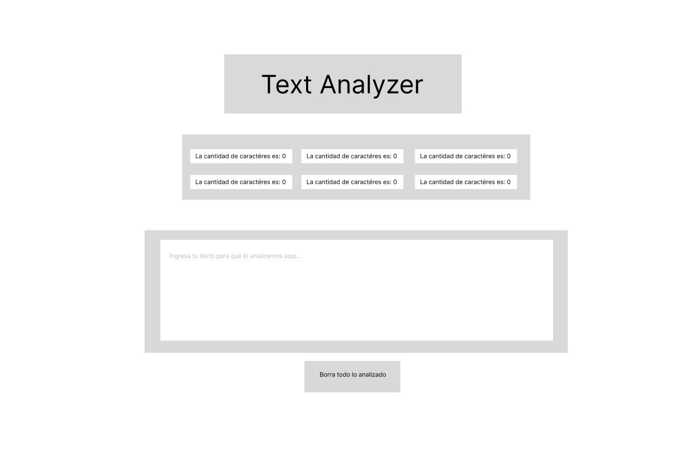
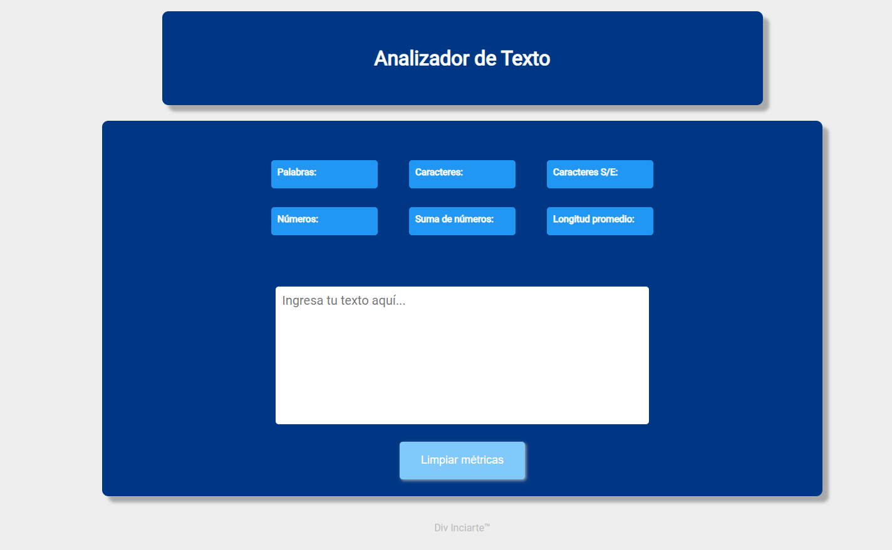

# Analizador de Texto

El Analizador de Texto es un programa que permitirá a sus usuarias poder analizar la cantidad de palabras, caracteres, números de cualquier tipo de texto ingresado en el área de texto y tiene un botón que permitirá eliminar las métricas y vaciará el campo de texto permitiendo ingresar datos nuevamente. 

# Diseño enfocado a la usuaria

El diseño realizado en el prototipo original era simple. Solo contemplaba un UI en el que se dispusiera de los elementos en una forma simple que permitiera la interacción de la usuaria. No contaba con colores definidos. 

Durante el desarrollo y luego de recibir el feedback de algunos usuarios se eligió una paleta de colores en azul y demás gradientes para resaltar los elementos importantes (las métricas) y las áreas de interacción de la usuaria como tal.

***
